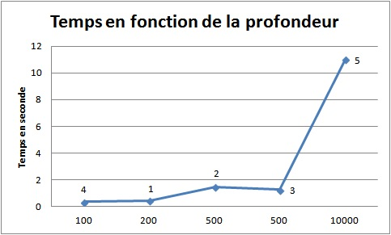

# Ensemble de Mandelbrot
## TP1 parallélisme 2017
### Prérequis
#### Installer MPI sur Linux
sudo apt-get install mipcc
#### Compiler avec MPI
mpicc mandel.c -o mandel -lm -Wall
#### Lancer le programme compilé
mpirun ou mpiexec -np X ./mandel
* -np : nombre de threads

### Calcul séquentiel
#### Question 1
##### A partir du code fourni, détaillez les choix techniques utilisés pour faire le calcul séquentiel.

Le calcul séquentiel utilise des tableau de char "pima" et "ima" codé sur 8 bits.

Le calcul séquentiel comporte 2 boucles "for" imbriquées et effectue le calcul pixel par pixel et par incrémentation.

Le calcul s'effectue dans le plan complexe,  pour se faire, on associe une coordonnée (x,y) à chaque pixel : (xmin,ymin) : coordonnées de premier pixel de l'image dans le plan complexe "xmax", "ymax", coordonnées du dernier pixel dans le plan complexe.

Puisque l'ensemble est discret alors que le plan est continu, on calcul l'incrément "xinc", "yinc" entre les coordonnées des pixels continus.

#### Question 2
##### Compiler et exécuter le code original

Compilation : gcc mandel.c -o mandel -lm

Exécution : ./mandel

Temps total de calcul : 5.27576 sec

##### Compiler et exécuter le code en changeant l'ensemble des paramètres (dimension, profondeur...).

||wight|hight|xmin|ymin|xmax|ymax|profondeur|temps|
|:-:|:-:|:-:|:-:|:-:|:-:|:-:|:-:|:-:|
|exemple 1|800|800|0,35|0,355|0,353|0,358|200|0,451928|
|exemple 2|800|800|-0,736|-0,184|-0,735|-0,183|500|1,48032|
|exemple 3|800|800|-0,736|-0,184|-0,735|-0,183|500|1,24872|
|exemple 4|800|800|-1,48478|0,00006|-1,48447|0,00044|100|0,348511|
|exemple 5|800|800|-1,5|-0,1|-1,3|0,1|10000|10,9986|




##### Commenter les résultats.

Ce qu'on peut en déduire est que le facteur le plus important est la profondeur. En effet, dans tous les cas, l'exepmle n°5 est celui qui prend le plus de temps. Le temps croit de manière presque linéaire lorsque la profondeur augmente.
Conclusion, il sera intéressant de tester nos parallélisations sur différente profondeur.

### Calcul parallèle
#### Question 3
##### Quels caractéristiques le rendent difficile à paralléliser ?

Le calcul de chaque pixel est indépendant bien que la fonction "xy2color" n'est pas parallélisable car dans sa boucle "for", les valeurs "x" et "y" sont écrasées à chaque implémentation.

Le calcul aux différentes profondeurs (fonction "xy2color") n'est pas parallélisable, puisque la valeur d'un pixel à la profondeur n+1 est une fonction complexe de la valeur de ce pixel à la profondeur (la valeur à la profondeur n+1 écrase en mémoire celle à la profondeur n).

En revanche, chaque pixel de l'image subit le même traitement (les 2 boucles imbriquées) qui ne dépend pas de la valeur d'autres pixels => partie parallélisable.

##### Proposer plusieurs stratégies pour paralléliser le code séquentiel en détaillant les choix techniques à prendre.

**charge statique** :

* le MAITRE et les ouvriers travaillent tous une fois.
* le MAITRE et les ouvriers se répartissent équitablement les pixels de l'image.
* le nombre de blocs est égal au nombre d'ouvriers plus le MAITRE;

**charge dynamique** :

* le processus MAITRE ne va rien calculer.
* le processus MAITRE devrait recevoir les lignes traités par ouvrier et si besoin de leur envoyer à nouveau d'autre lignes à traiter.
* le nombre de blocs est un argument du programme => caractérisé par le nombre de lignes à traiter.
* répartition dynamique des charges.

##### Donner les algorithmes de chacun de vos stratégies de parallélisassions.

**Architecture des processus à mémoire distribuée**

**Algo1 allocation mémoire**
```
Données :
	h: Hauteur totale de l'image
	w : Longueur totale de l'image
	rank : rang du processus
	h_local : hauteur d'un bloc
```
```
si rank == MAITRE alors
	pima = ima = malloc(taille de l'image)
sinon
	pima = ima = malloc(taille d'un bloc)
fin si
algo (Maître) Partie 1.
if (rank == Maître)
	* allocation dynamique de l'image globale : w*h*sizeof(char)
	* test de l'allocation dynamique
	* calcul de la position de début de l'image locale du maître
	pima ← (rank * w * h_local)
	// pareil en séquentielle
	y ← ymin_local et i passe de 0 à h_local
fin si
```
**algo : Envoi/réception des blocs**
```
Données : w, rank, h_local, ima, pima
```
```
Début
	si rank == MAITRE alors
		pour tous les ouvriers faire
			// attente d'un message
			MPI_Probe()
			si S!= MAITRE alors
				// assemblage du bloc
				MPI_Recv ()
			fin si
		fin pour tous
		sauvegarde de l'image
		affichage chrnometre
	sinon
		MPI_Send()
	fin si
fin
```
**Charge dynamique**

algo Maître
```
* allocation dynamique de l'image globale
* test de l'allocation dynamique
* pour i va de 0 à nb_proc faire
	* si i != RANK_MAITRE
		* on envoie au esclave de rang i num_bloc
		* on incrémente num_bloc
* pour i va de 0 à h / nb_lignes faire
	* on reçoit le numéro du bloc fait par l'ouvrier
	* on détermine le rang de l'émetteur
	* on reçoit le calcul
	* s'il reste du calcul à faire on envoie un numéro de bloc à calculer à l'ouvrier qui a envoyer le calcul
	* sinon, on envoie un message en indiquant la fin du travail
```

##### Modifier le code séquentiel pour l'adapter à une architecture parallèle à mémoire distribuée exploitée au moyen de MPI.
**Charge statique**
```C
int main(int argc, char *argv[]) {
	MPI_Init(&argc, &argv);
	int size;
	int myrank;
	int h_local;
	MPI_Status status;
	/* Domaine de calcul dans le plan complexe */
	double xmin, ymin;
	double xmax, ymax;
	/* Dimension de l'image */
	int w,h;
	/* Pas d'incrementation */
	double xinc, yinc;
	/* Profondeur d'iteration */
	int prof;
	/* Image resultat */
	unsigned char *ima, *pima;
	/* Variables intermediaires */
	int  i, j;
	double x, y;
	/* Chronometrage */
	double debut, fin;

	/* debut du chronometrage */
	debut = my_gettimeofday();


	if( argc == 1) fprintf( stderr, "%s\n", info);

	/* Valeurs par defaut de la fractale */
	xmin = -2; ymin = -2;
	xmax =  2; ymax =  2;
	w = h = 800;
	prof = 10000;

	/* Recuperation des parametres */
	if( argc > 1) w    = atoi(argv[1]);
	if( argc > 2) h    = atoi(argv[2]);
	if( argc > 3) xmin = atof(argv[3]);
	if( argc > 4) ymin = atof(argv[4]);
	if( argc > 5) xmax = atof(argv[5]);
	if( argc > 6) ymax = atof(argv[6]);
	if( argc > 7) prof = atoi(argv[7]);

	/* Calcul des pas d'incrementation */
	xinc = (xmax - xmin) / (w-1);
	yinc = (ymax - ymin) / (h-1);
	/* passage du plan complexe au plan discret */

	/* affichage parametres pour verification */
	/*fprintf( stderr, "Domaine: {[%lg,%lg]x[%lg,%lg]}\n", xmin, ymin, xmax, ymax);
	fprintf( stderr, "Increment : %lg %lg\n", xinc, yinc);
	fprintf( stderr, "Prof: %d\n",  prof);
	fprintf( stderr, "Dim image: %dx%d\n\n", w, h);*/

	// Combien de processus y a-t-il dans le communicateur ?
	MPI_Comm_size(MPI_COMM_WORLD, &size);
	if (h % size != 0) {
		printf("h_local n'est pas un entier !\n");
		return 1;
	}
	h_local = h / size;

	// Qui suis-je ?
	MPI_Comm_rank(MPI_COMM_WORLD, &myrank);

	//printf("RANK = %d\n\n", myrank);

	//printf("Allocation RANK = %d\n\n", myrank);
	if (myrank == MAITRE){ // MAITRE
		/* Allocation memoire du tableau resultat */
		pima = ima = (unsigned char *)malloc( w*h*sizeof(unsigned char));
	}
	else {
		/* Allocation memoire du tableau resultat */
		pima = ima = (unsigned char *)malloc( w*h_local*sizeof(unsigned char));
	}
	//printf("Allocation finie RANK = %d\n\n", myrank);

	if( ima == NULL) {
		fprintf( stderr, "Erreur allocation mémoire du tableau \n");
		return 1;
	}

	/* Traitement de la grille point par point */
	//printf("Traitement de la grille point par point RANK = %d\n\n", myrank);
	y = ymin + h_local * myrank * yinc;
	for (i = 0; i < h_local; i++) {   
		x = xmin;
		for (j = 0; j < w; j++) {
			//printf("%d\n", xy2color( x, y, prof));
			//printf("(x,y)=(%g;%g)\t (i,j)=(%d,%d)\n", x, y, i, j);
			*pima++ = xy2color( x, y, prof);
			x += xinc;
		}
		y += yinc;
	}
	//printf("Traitement de la grille point par point fini RANK = %d\n\n", myrank);

	//printf("Envoie réception RANK = %d\n\n", myrank);
	if (myrank == MAITRE){ // MAITRE
		for ( i = 1 ; i < size ; i++) {
			//printf("Réception en attente... RANK = %d\n\n", myrank);
			int s;
			// attente d'un message
			MPI_Probe(MPI_ANY_SOURCE, 0, MPI_COMM_WORLD, &status);
			s = status.MPI_SOURCE;
			if (s != MAITRE) {
				//printf("Assemblage du bloc... RANK = %d\n\n", myrank);
				// assemblage du bloc
				MPI_Recv(ima + s * w * h_local * sizeof(unsigned char), h_local * w, MPI_CHAR, s, 0, MPI_COMM_WORLD, &status);
			}
		}
		//printf("SAUVEGARDE RANK = %d\n\n", myrank);
		/* Sauvegarde de la grille dans le fichier resultat "mandel.ras" */
		sauver_rasterfile( "mandel.ras", w, h, ima);
		free(ima);
		/* fin du chronometrage */
		fin = my_gettimeofday();
		fprintf( stderr, "Temps de calcul : %g sec\nRANK = %d\n\n", fin - debut, myrank);
		//fprintf( stdout, "%g\n", fin - debut);
	}
	else {
		MPI_Send( ima, h_local * w, MPI_CHAR, MAITRE, 0, MPI_COMM_WORLD);
		/* fin du chronometrage */
		fin = my_gettimeofday();
		fprintf( stderr, "Temps de calcul : %g sec\nRANK = %d\n\n", fin - debut, myrank);
		//fprintf( stdout, "%g\n", fin - debut);
	}
	//printf("Envoie réception fini RANK = %d\n\n", myrank);

	MPI_Finalize();
	return 0;
}
```
**Charge dynamique**
```C
int main(int argc, char *argv[]) {
	/* Domaine de calcul dans le plan complexe */
	double xmin, ymin;
	double xmax, ymax;
	/* Dimension de l'image */
	int w,h;
	/* Pas d'incrementation */
	double xinc, yinc;
	/* Profondeur d'iteration */
	int prof;
	/* Image resultat */
	unsigned char *ima, *pima, *ima_loc, *pima_loc;
	/* Variables intermediaires */
	int  i, j;
	double x, y;
	/* Chronometrage */
	double debut, fin;
	/* Nombre ligne par bloc */
	int nlin;
	/* Calcul fini */
	int finCalc = 0;

	/* debut du chronometrage */
	debut = my_gettimeofday();

	if( argc == 1) fprintf( stderr, "%s\n", info);

	/* Valeurs par defaut de la fractale */
	xmin = -2; ymin = -2;
	xmax =  2; ymax =  2;
	w = h = 800;
	prof = 10000;
	nlin = 8;

	/* Recuperation des parametres */
	if( argc > 1) nlin = atoi(argv[1]);
	if( argc > 2) w    = atoi(argv[2]);
	if( argc > 3) h    = atoi(argv[3]);
	if( argc > 4) xmin = atof(argv[4]);
	if( argc > 5) ymin = atof(argv[5]);
	if( argc > 6) xmax = atof(argv[6]);
	if( argc > 7) ymax = atof(argv[7]);
	if( argc > 8) prof = atoi(argv[8]);

	/* Calcul des pas d'incrementation */
	xinc = (xmax - xmin) / (w-1);
	yinc = (ymax - ymin) / (h-1);

	/**
	*** Début parallelisation
	**/
	int rank; // rang du processeur
	int p; // nombre processeur

	MPI_Init(&argc, &argv); /* starts MPI */
	MPI_Comm_rank(MPI_COMM_WORLD, &rank); /* get current process id */
	MPI_Comm_size(MPI_COMM_WORLD, &p);

	int nBloc = h / nlin; // Nombre de blocs
	int num_bloc = 0; // Numero bloc
	int num_bloc_rec = 0; // Numero bloc recu
	int nBloc_recu = 0; // nombre bloc recu

	int stop = -1;

	MPI_Status status;

	if(rank == MAITRE){

		/* Affichage parametres pour verification */
		fprintf( stderr, "Rang: %d\n", rank);
		fprintf( stderr, "Domaine: {[%lg,%lg]x[%lg,%lg]}\n", xmin, ymin, xmax, ymax);
		fprintf( stderr, "Increment : %lg %lg\n", xinc, yinc);
		fprintf( stderr, "Prof: %d\n",  prof);
		fprintf( stderr, "Dim image: %dx%d\n", w, h);
		fprintf( stderr, "Nombre lignes par bloc: %d\n", nlin);

		/* Allocation memoire du tableau resultat */  
		pima = ima = (unsigned char *)malloc( w*h*sizeof(unsigned char));
		if( ima == NULL) {
			fprintf( stderr, "Erreur allocation mémoire du tableau \n");
			return 0;
		}

		for(i = 0 ; i <p ; i++){
			if(i != MAITRE){
				// On envoie au esclave de rang i num_bloc
				MPI_Send(&num_bloc, 1, MPI_INT, i, TAG_NUM_BLOC, MPI_COMM_WORLD);
			num_bloc+=1;
			}
		}


		while(finCalc == 0){
			/* Reception donnees ouvrier */

			// On determine le rang de l'émetteur
			MPI_Probe(MPI_ANY_SOURCE, TAG_NUM_BLOC, MPI_COMM_WORLD, &status);
			int rank_src = status.MPI_SOURCE; // rank de la source

			if (rank_src != MAITRE) {
				// On reçoit le numéro de bloc traite par l'ouvrier
				MPI_Recv(&num_bloc_rec, 1, MPI_INT, rank_src, TAG_NUM_BLOC,MPI_COMM_WORLD, &status);

				// On reçoit le bloc traité
				MPI_Recv(ima + num_bloc_rec*nlin*w*sizeof(unsigned char), nlin*w, MPI_CHAR, rank_src, TAG_IM, MPI_COMM_WORLD, &status);

				nBloc_recu ++;

				// Test fin de calcul de l'image
				if(num_bloc >= nBloc){
					MPI_Send(&stop, 1, MPI_INT, rank_src, TAG_NUM_BLOC, MPI_COMM_WORLD);
				}else{
					MPI_Send(&num_bloc, 1, MPI_INT, rank_src, TAG_NUM_BLOC, MPI_COMM_WORLD);
					num_bloc+=1;
				}

				// Si tous recu on se stope
				if(nBloc_recu == nBloc){

				}
			}
		}

		/* fin du chronometrage */
		fin = my_gettimeofday();
		fprintf( stderr, "Rang %d | Temps total de calcul : %g sec\n", rank,
		fin - debut);

		/* Sauvegarde de la grille dans le fichier resultat "mandel.ras" */
		sauver_rasterfile( "mandel.ras", w, h, ima);

		}else{

		/* Affichage parametres pour verificatrion */
		fprintf( stderr, "Rang: %d\n", rank);

		/* Allocation memoire locale */  
		ima_loc = (unsigned char *)malloc( w*nlin*sizeof(unsigned char));
		if( ima_loc == NULL) {
		fprintf( stderr, "Erreur allocation mémoire du tableau \n");
		return 0;
		}

		while(finCalc == 0){
			// Reception numéro de bloc à traiter
			MPI_Recv(&num_bloc, 1, MPI_INT, MAITRE, TAG_NUM_BLOC,MPI_COMM_WORLD, &status);

			if(num_bloc == -1){
				finCalc = -1;
			}else{
				pima_loc = ima_loc;

				/* Traitement d'un bloc point par point */
				y = ymin + nlin*num_bloc*yinc;
				for (i = 0; i < nlin; i++) {
						x = xmin;
					for (j = 0; j < w; j++) {
						// printf("%d\n", xy2color( x, y, prof));
						// printf("(x,y)=(%g;%g)\t (i,j)=(%d,%d)\n", x, y, i, j);
						*pima_loc++ = xy2color( x, y, prof);
						x += xinc;
					}
					y += yinc;
				}

				// Envoie au master du numéro de bloc
				MPI_Send(&num_bloc, 1, MPI_INT, MAITRE, TAG_NUM_BLOC, MPI_COMM_WORLD);

				// Envoie au master du bloc
				MPI_Send(ima_loc, nlin * w, MPI_CHAR, MAITRE, TAG_IM, MPI_COMM_WORLD);

			}
		}

		/* fin du chronometrage */
		fin = my_gettimeofday();
		fprintf( stderr, "Rang %d | Temps total de calcul : %g sec\n", rank,
		fin - debut);
	}

	MPI_Finalize();

	return 0;
}
```
### Analyse des performances
##### Calculer le temps d'exécution, l'accélération et l'efficacité de votre code parallèle en changeant le nombre de processus (2, 4, 8, 16, 32...)

|cœurs|0|1|2|3|4|5|6|7|8|9|10|11|12|13|14|15|16|17|18|19|20|21|22|23|24|25|26|27|28|29|30|31|
|:-:|:-:|:-:|:-:|:-:|:-:|:-:|:-:|:-:|:-:|:-:|:-:|:-:|:-:|:-:|:-:|:-:|:-:|:-:|:-:|:-:|:-:|:-:|:-:|:-:|:-:|:-:|:-:|:-:|:-:|:-:|:-:|
|2|15,7309|15,7264|
|4|15,6552|15,6508|15,65|0,068229|
|8|26,3584|0,109994|5,02007|26,3345|26,1365|5,2426|0,0601041|0,040062|
|16|31,6441|0,0079031|0,00778389|0,041436|1,20338|9,24078|20,4071v31,6269|31,4816|20,543|9,23843|1,44207|0,041342|0,008219|0,0438812|0,00748301|
|32|33,5238|0,00984001|0,00367284|0,00374603|0,00381088|0,00398493|0,00433588|0,00700593|0,0779471|2,54264|3,77606|14,3852|18,8261|22,1011|29,7993|33,4004|33,0755|30,0371|22,0508|18,7188|14,8054|4,01999|2,58258|0,0741789|0,00704193|0,0253141|0,00397515|0,0038209|0,00433993|0,00362492|0,00616097|0,00332403|

##### Analyser les résultats obtenus (penser à faire des courbes et des tableaux)


##### Montrer le temps d'exécution de chaque processus (maître et esclaves) en changeant le nombre de processus (2, 4, 8, 16, 32...)

|cœurs|0|1|2|3|4|5|6|7|8|9|10|11|12|13|14|15|16|17|18|19|20|21|22|23|24|25|26|27|28|29|30|31|
|:-:|:-:|:-:|:-:|:-:|:-:|:-:|:-:|:-:|:-:|:-:|:-:|:-:|:-:|:-:|:-:|:-:|:-:|:-:|:-:|:-:|:-:|:-:|:-:|:-:|:-:|:-:|:-:|:-:|:-:|:-:|:-:|
|2|18,8615|18,8614|
|4|6,36546|6,36523|6,35079|6,34723|
|8|5,74047|5,64838|5,62876|5,62087|5,60914|5,67286|5,63418|5,73136|
|16|5,97668|5,55199|5,4806|5,44129|5,44121|5,44079|5,71073|5,52433|5,45788|5,58246|5,60836|5,39156|5,38522|5,90877|5,43034|5,59663|
|32|7,67666|4,98651|5,00476|5,36237|5,26958|5,72819|6,55624|5,37204|6,78133|7,21012|7,13235|7,11345|7,68597|7,65321|7,42624|7,29925|5,03845|5,02699|4,88739|7,06961|6,83419|6,48376|5,61092|4,93575|4,92338|5,11005|5,0286|4,89946|4,92674|4,92847|5,12013|5,03672|

##### Analyser les résultats obtenus (penser à faire des courbes et des tableaux)


##### Montrer la différence entre les stratégies proposées en basant sur vos résultats de calcul obtenues.

La différence est assez flagrande. Concernant la **charge statique**, l'image est répartite de manière homogène aux threads ce qui explique que les threads qui traitent le milieu de l'image mettent plus de temps que les threads traitant l'image à ses extrémités. Les threads du milieu recevant autant de pixels que chacun des autres threads, ont plus de calcul à effectuer, donc mettent plus de temps à travailler malgré la répartition homogène. Notons que le thread n°0 est celui qui travaille toujours le plus, étant le maître, il reçoit le travail de chacun des ouvriers pour reconstituer l'image.

Alors que pour la **charge dynamique**, tant que toutes les lignes de l'image ne sont pas traitées, le thread maître envoye du travail aux ouvriers ayant rendu le leur. C'est ainsi que les ouvriers du milieu traiteront moins de lignes que les ouvriers des extrémités. Et au final le temps de calcul est homogène d'un thread à l'autre.

La charge dynamique est efficace à partir de 4 threads et divise le temps de calcul au moins par 2 voir jusqu'à 5.

### Amélioration (facultatif)
##### Proposer des améliorations au niveau des vos stratégies afin de les optimiser au maximum.
